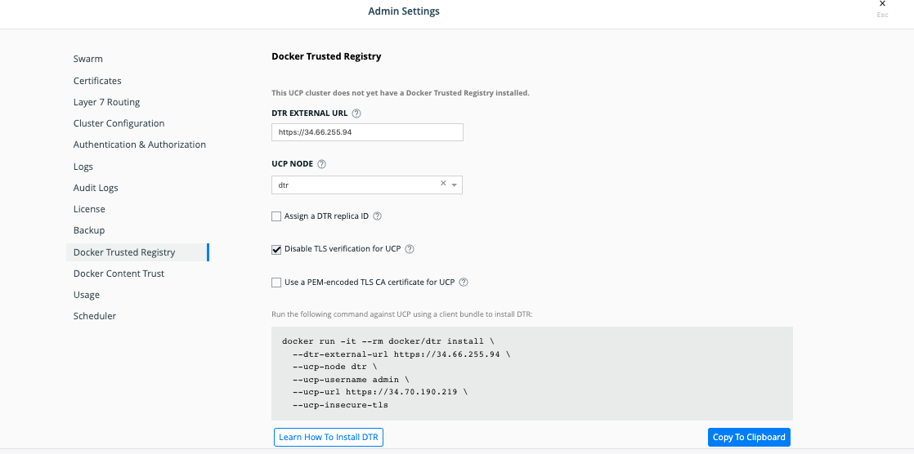

# Source: https://docs.docker.com/ee/dtr/admin/install/

once your ucp cluster is ready and the DTR-node as a worker node.


dtr-external-url= extternal ip of dtr node
ucp-node= dtr node name
ucp-url= ip of ucp node

### steps

It will download all the 2.7.2 dtr images and register with the ucp and install

```shell
is@dtr ~]$ sudo docker run -it --rm docker/dtr install  --dtr-external-url https://34.66.255.94  --uc
p-node dtr  --ucp-username admin  --ucp-url https://34.70.190.219  --ucp-insecure-tls
INFO[0000] Beginning Docker Trusted Registry installation
ucp-password:
INFO[0005] Validating UCP cert                          
INFO[0005] Connecting to UCP                            
INFO[0005] health checking ucp                                                 
```

You can get the same command from ucp as well , you need to navigate to ucp > admin setting > docker Trusted Registry



Hit to the extrenal url of DTR and you will able to view the DTR.


