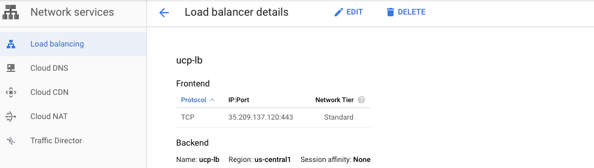

What you will learn:

This reference architecture describes a standard production-level Docker EE deployment. It also details the various components of Docker EE, including how they work, how to automate deployment, how to manage users and teams, how to provide high availability for the platform, and how to manage the infrastructure and please look for the new updates and respective article for more info.

Please note : some Enviroment specific details will not be provided as things may differ from different cloud providers and on-premises infrastructures as well.

In a production environment, minimizing downtime for critical services is critical. It is important to understand how to achieve high availability (HA) in UCP and DTR, and what to do if a failure occurs. UCP and DTR use the same principle to provide HA, but UCP has a more direct correlation with Swarm's functionality. The general principle is to replicate core services in a cluster, so that when one node fails, the other nodes can take over. The load balancer provides the user with a stable hostname that is independent of the actual node that handles the request, making the service transparent to the user. This is the basic clustering mechanism that provides HA.

## UCP
UCP runs a global service called all cluster nodes ucp-agent. This agent installs one UCP controller on each of the Swarm management nodes. There is a one-to-one correspondence between the Swarm management node and the UCP controller, but they assume different roles. UCPs that use this agent rely on Swarm to implement Ha, but also include some replicated data stores that rely on their own raft consistency set different from Swarm: ucp-auth-store (a replicate database for identity management data) and ucp- Kv (copy key-value storage for UCP configuration data).

## License
Docker EE License - a Docker EE license (either trial or purchased) will be provided in your Docker Store account: https://store.docker.com/?overlay=subscriptions . You can license your install after the install has completed through the Web UI of Universal Control Plane.

For this, i will be using [Redhat](assets/ucp_HA_setup-824ff.png) lic and packages.

 [link](assets/https://github.com/pradhans0906/dockerlabs/blob/master/docker-ee/Redhat/docker-ee-ucp/assets/ucp_HA_setup-824ff.png)

Installation :
 Am using GCP for this demo and taking total 5 nodes - 3 UCP nodes and 2 worker nodes (DTR will be installed )
   see ucpdocs for more info https://docs.docker.com/datacenter/ucp/2.2/guides/admin/install/system-requirements/

[Architecture](https://github.com/pradhans0906/dockerlabs/blob/master/docker-ee/Redhat/docker-ee-ucp/explorer/Screenshot%202019-10-05%20at%2011.26.02%20PM.png)

Am using RHEL7 with 3 nodes having 2 core cpu with 7.5GB of RAM with 25 G of disk.


Create 3 vms and install docker-ee on those machine.

These are the steps i have followed to install docker-ee on the RHEL box
```shell
export DOCKERURL="https://storebits.docker.com/ee/rhel/sub-b752795b-73da-4bb0-9ca2-cea3cd04dacd" # this link you will get once you subscribed to docker EE

  sudo -E sh -c 'echo "$DOCKERURL/rhel" > /etc/yum/vars/dockerurl'
  sudo sh -c 'echo "7" > /etc/yum/vars/dockerosversion'
  sudo yum install -y yum-utils wget device-mapper-persistent-data  lvm2 # uses devicemapper/thinpool storage driver
  sudo -E yum-config-manager --add-repo "$DOCKERURL/rhel/docker-ee.repo"
  sudo yum -y install docker-ee docker-ee-cli containerd.io # instals dependent container-selinux as well.
```
## UCP Installation:

There are 2 ways to do it :
   1. Usually prod nodes wont be having access to the internet , so it wont pull the images , you need to pull it and push it to your private dtr or image repo and then you can pull and start using it.
   2. get the tar.gz file and store it where your prod nodes will be having access and load it with
   ```shell
    wget https://packages.docker.com/caas/ucp_images_3.2.1.tar.gz
    docker load -i ucp_tar.gz
 ```

we will see both the ways, so that you can opt based on your case.

Login to the 1st node

get the internal and extrenal ip address

```shell
MANAGER_INTERNAL_IP=$(curl -H "Metadata-Flavor: Google"http://metadata/computeMetadata/v1/instance/network-interfaces/0/ip)
MANAGER_EXTERNAL_IP=$(curl -H "Metadata-Flavor: Google" http://metadata/computeMetadata/v1/instance/network-interfaces/0/access-configs/0/external-ip)
```

```shell
docker container run --rm --name ucp -v /var/run/docker.sock:/var/run/docker.sock docker/ucp:3.2.1 install -
-admin-username admin --admin-password password --host-address $MANAGER_INTERNAL_IP --san $MANAGER_EXTERNAL_IP  --debug
```
The above process may take sometime and lastly you will see these messages about your ucp.

```shell
time="2019-10-05T19:43:25Z" level=info msg="Step 35 of 35: [Wait for All Nodes to be Ready]"
time="2019-10-05T19:43:31Z" level=debug msg="[Wait for All Nodes to be Ready] Completed"
time="2019-10-05T19:43:31Z" level=info msg="All Installation Steps Completed"
```
Now go to your node external ip address and you will able to view the ucp ui and login with your crendentials.

login to the 2nd and 3rd node and install docker and download ucp.tar.gz

```shell
wget https://packages.docker.com/caas/ucp_images_3.2.1.tar.gz
Length: 671958665 (641M) [application/x-gzip]
Saving to: ‘ucp_images_3.2.1.tar.gz’
100%[=========================================================================>] 671,958,665 12.4MB/s   in 56s    
2019-10-05 20:00:42 (11.5 MB/s) - ‘ucp_images_3.2.1.tar.gz’ saved [671958665/671958665]
[is@ucp2 ~]$ sudo docker load -i ucp_images_3.2.1.tar.gz
```

join the node by creating master token

```shell
docker swarm join-token manager
```
Get the token and paste the output on the 2nd and 3rd node after sucessful loading of the images and the out put will come as below

This node joined a swarm as a manager.

After this you have a cluster of 3 nodes of ucp ready and all these are manager nodes But these are not load balanced and to do that we will need a LB.

### Create LB on GCP
Navigate
Networking > Network services > loadbalancing > create loadbalancer > tcp

<<<<<<< HEAD
[Lb config]

Now login with LB ip - https://35.209.137.120:443 and you will be redirected to one of the service UCP on the LB and now your you have enabled HA on ucp
=======
[Lb config](https://github.com/pradhans0906/dockerlabs/blob/master/docker-ee/Redhat/docker-ee-ucp/assets/ucp_HA_setup-eb04b295.png)

Now login with LB ip and now your you have enabled HA on ucp.

--pradhans0906 aka swapnasagar pradhan

>>>>>>> 316e46541a48961295360b75a54c181e198667cd
