[Mermaid](https://mermaidjs.github.io/) est une bibliothèque Javascript qui permet de générer des diagrammes (séquence, état, gantt, etc.) à partir de texte, dans le même style que Markdown.

Insérer votre code Mermaid dans un shortcode `mermaid` et c'est tout.

## Flowchart example
	
	graph LR;
		A[Bords droits] -->|Lien texte| B(Bords arondis)
    	B --> C{Décision}
    	C -->|Un| D[Résultat un]
    	C -->|Deux| E[Résultat deux]
    

renders as


graph LR;
	A[Bords droits] -->|Lien texte| B(Bords arondis)
	B --> C{Décision}
	C -->|Un| D[Résultat un]
	C -->|Deux| E[Résultat deux]


or you can use this alternative syntax:

<pre>

</pre>

renders as

## Sequence example

	
	sequenceDiagram
	    participant Alice
	    participant Bob
	    Alice->>John: Salut John, comment vas-tu?
	    loop Vérification
	        John->John: Se bat contre l'hyponcodrie.
	    end
	    Note right of John: Les pensées rationnelles prédominent...
	    John-->Alice: Super!
	    John->Bob: Et toi?
	    Bob-->John: Au top!
	

renders as


sequenceDiagram
	participant Alice
	participant Bob
	Alice->>John: Salut John, comment vas-tu?
	loop Vérification
		John->John: Se bat contre l'hyponcodrie.
	end
	Note right of John: Les pensées rationnelles prédominent...
	John-->Alice: Super!
	John->Bob: Et toi?
	Bob-->John: Au top!


or you can use this alternative syntax:

<pre>

</pre>

renders as

## GANTT Example

	
	gantt
	        dateFormat  YYYY-MM-DD
	        title Ajout de la fonctionnalité de GANTT à Mermaid
	        section Une section
	        Tâche complétée            :done,    des1, 2014-01-06,2014-01-08
	        Tâche en cours             :active,  des2, 2014-01-09, 3d
	        Future tâche               :         des3, after des2, 5d
	        Future tâche 2             :         des4, after des3, 5d
	        section Tâches critiques
	        Tâche complétée dans le chemin critique :crit, done, 2014-01-06,24h
	        Implémenter le parser et jison          :crit, done, after des1, 2d
	        Créer des tests pour le parser          :crit, active, 3d
	        Future tâche dans le chemin critique    :crit, 5d
	        Créer des tests pour le renderer        :2d
	        Ajout à Mermaid                      	:1d
	

renders as


gantt
		dateFormat  YYYY-MM-DD
		title Ajout de la fonctionnalité de GANTT à Mermaid
		section Une section
		Tâche complétée            :done,    des1, 2014-01-06,2014-01-08
		Tâche en cours             :active,  des2, 2014-01-09, 3d
		Future tâche               :         des3, after des2, 5d
		Future tâche 2             :         des4, after des3, 5d
		section Tâches critiques
		Tâche complétée dans le chemin critique :crit, done, 2014-01-06,24h
		Implémenter le parser et jison          :crit, done, after des1, 2d
		Créer des tests pour le parser             :crit, active, 3d
		Future tâche dans le chemin critique        :crit, 5d
		Créer des tests pour le renderer           :2d
		Ajout à Mermaid                      :1d


or you can use this alternative syntax:

<pre>

</pre>

renders as

### Class example

```mermaid
classDiagram
  Class01 <|-- AveryLongClass : Cool
  Class03 *-- Class04
  Class05 o-- Class06
  Class07 .. Class08
  Class09 --> C2 : Where am i?
  Class09 --* C3
  Class09 --|> Class07
  Class07 : equals()
  Class07 : Object[] elementData
  Class01 : size()
  Class01 : int chimp
  Class01 : int gorilla
  Class08 <--> C2: Cool label
```

<pre>

</pre>

renders as

### Git example

<pre>

</pre>

renders as

