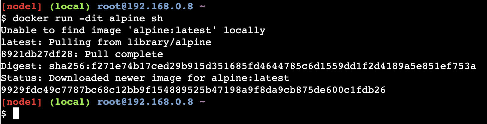
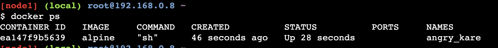
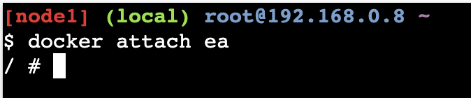
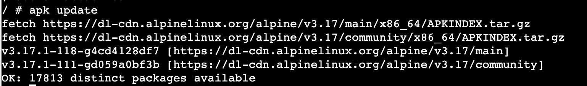
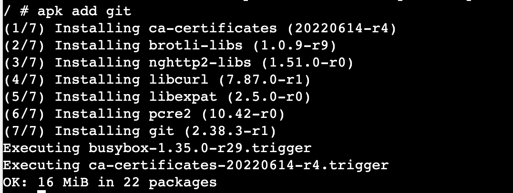
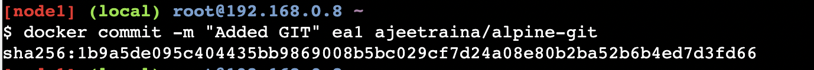
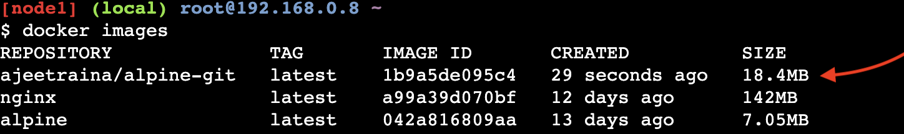
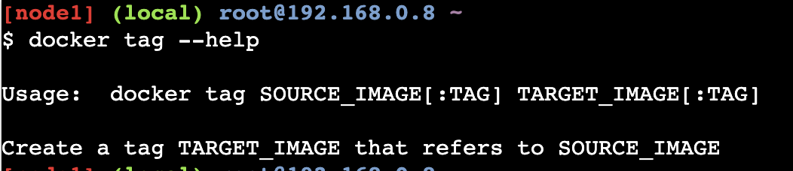
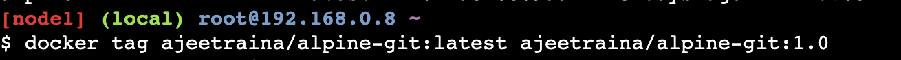

# How to build Your First Alpine Docker Image and Push it to DockerHub

## Tested Infrastructure

| **Platform**         | **Number of Instance** | **Reading Time** |
| -------------------- | ---------------------- | ---------------- |
| **Play with Docker** | **1**                  | **5 min**        |

## Pre-requisite

Create an account with [DockerHub](https://hub.docker.com/)

Under this tutorial we will see how to build our own first alpine based Docker Image.

`docker run -dit alpine sh`



- -d: This option tells Docker to run the container in detached mode, which means the container will run in the background and the command prompt will be returned immediately.

- -i: This option tells Docker to keep the standard input (STDIN) open, even if not attached. This allows you to interact with the container, for example by running commands inside it.

- -t: This option tells Docker to allocate a pseudo-TTY, which is a terminal in the container. This allows you to run interactive commands inside the container, for example by starting a shell.





# Updating APK Packages

`apk update`



`apk add git`



# Now lets come out of it by Ctrl+P+Q and commit the changes

`docker commit -m "Added GIT" 620 ajeetraina/alpine-git`



`docker images`



There you see a new image just created.

# Time to tag the image

`docker tag --help`



`docker tag ajeetraina/alpine-git:latest ajeetraina/alpine-git:1.0`



# Pushing it to DockerHub

```
$ docker login
Login with your Docker ID to push and pull images from Docker Hub. If you don't have a Docker ID, head over to https://hub.docker
.com to create one.
Username: ajeetraina
Password:
WARNING! Your password will be stored unencrypted in /root/.docker/config.json.
Configure a credential helper to remove this warning. See
https://docs.docker.com/engine/reference/commandline/login/#credentials-store

Login Succeeded
[node4] (local) root@192.168.0.20 ~
```

```
$ docker push ajeetraina/alpine-git:1.0
The push refers to repository [docker.io/ajeetraina/alpine-git]
3846235f8c17: Pushed
bcf2f368fe23: Mounted from library/alpine
1.0: digest: sha256:85d50f702e930db9e5b958387e667b7e26923f4de340534085cea184adb8411e size: 740
[node4] (local) root@192.168.0.20 ~
```
