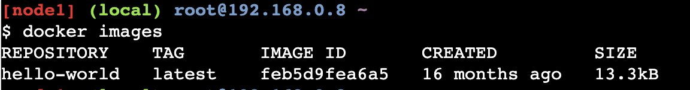

# Demonstrating Hello World Example

## Tested Infrastructure

|    Platform    | Tested on | Reading Time |
| :------------: | :-------: | :----------: |
| Docker Desktop |   MacOS   |    5 min     |

## Pre-requisite

- Create an account with [DockerHub](https://hub.docker.com)

## Running Hello World Example

```
$ docker run hello-world

```


## Explanation

This image is a prime example of using the scratch image effectively. See hello.c in https://github.com/docker-library/hello-world for the source code of the hello binary included in this image.

So what’s happened here? We’ve called the docker run command, which is responsible for launching containers.

The argument hello-world is the name of the image someone created on dockerhub for us. It will first search for "hello-world" image locally and then search in Dockerhub.

Once the image has been downloaded, Docker turns the image into a running container and executes it.

## Did you Know?

- The Hello World Docker Image is only 1.84 KB size.



- While running `docker ps` command, it doesn't display any running container. Reason - It gets executed once and exit immediately.


- You can use `docker inspect <imagename>` command to inspect about this particular Docker Image.


## Contributor

[Ajeet Singh Raina](ajeetraina@gmail.com)

[Next: Working with Docker Images](https://collabnix.github.io/dockerlabs/beginners/workingwithdockerimage.html)
