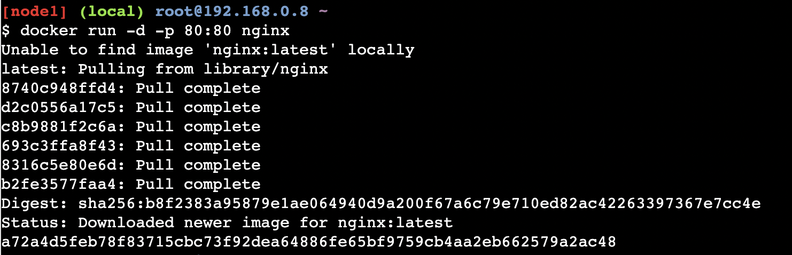
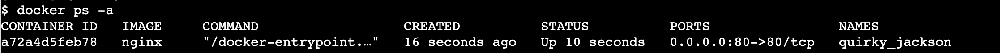
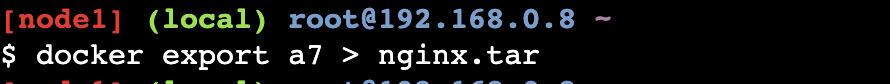
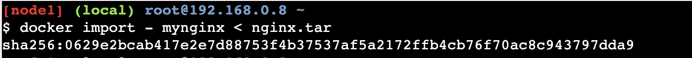
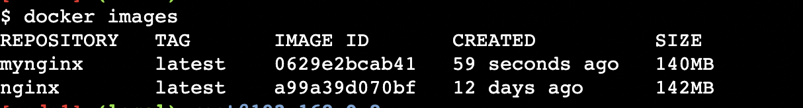
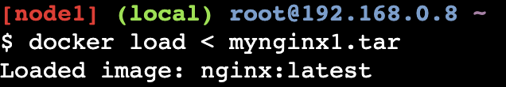
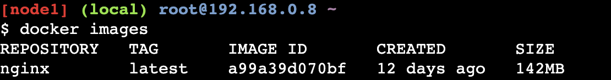

# Saving Images and Containers as Tar Files for Sharing

## Docker - Beginners | Intermediate | Advanced

Imagine a scenario where you have built Docker images and containers that you would be interested to keep and share it with your other collaborators or colleagues. The below methods shall help you achieve it.

Four basic Docker CLI comes into action:

- The `docker export` - Export a container’s filesystem as a tar archive
- The `docker import` - Import the contents from a tarball to create a filesystem image
- The `docker save` - Save one or more images to a tar archive (streamed to STDOUT by default)
- The `docker load` - Load an image from a tar archive or STDIN

## Tested Infrastructure

| **Platform**         | **Number of Instance** | **Reading Time** |
| -------------------- | ---------------------- | ---------------- |
| **Play with Docker** | **1**                  | **5 min**        |

## Pre-requisite

- Create an account with [DockerHub](https://hub.docker.com/)

## Create Nginx Container

`docker run -d -p 80:80 nginx`



## Displaying Running Container

`docker ps -a`



`docker export df2 > nginx.tar`



You could commit this container as a new image locally, but you could also use the Docker import command:

`docker import - mynginx < nginx.tar`





If you wanted to share this image with one of your collaborators, you could upload the tar file on a web server and let your collaborator download it and use the import command on his Docker host.

If you would rather deal with images that you have already committed, you can use the load and save commands:

`docker save -o mynginx1.tar nginx`


```
$ ls -l
total 218756
-rw-------    1 root     root     112844800 Dec 18 02:53 mynginx1.tar
-rw-r--r--    1 root     root     111158784 Dec 18 02:50 nginx.tar
```

```
$ docker rmi mynginx
Untagged: mynginx:latest
Deleted: sha256:aaaed50d250a671042e8dc383c6e05012e245f5eaf555d10c40be63f6028ee7b
Deleted: sha256:41135ad184eaac0f5c4f46e4768555738303d30ab161a7431d28a5ccf1778a0f
```

Now delete all images and containers running and try to run the below command to load Docker image into your system:

```
$ docker images
REPOSITORY          TAG                 IMAGE ID            CREATED             SIZE
```

`docker load < mynginx1.tar`



