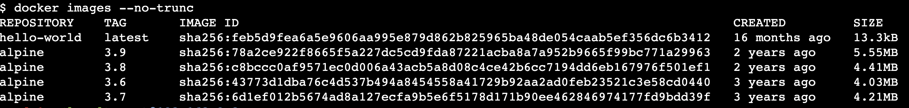

# Working with Docker Images

## Tested Infrastructure

| **Platform**         | **Number of Instance** | **Reading Time** |
| -------------------- | ---------------------- | ---------------- |
| **Play with Docker** | **1**                  | **5 min**        |

## Pre-requisite

- Create an account with [DockerHub](https://hub.docker.com/)

## Listing the Docker Images

## Show all images (default hides intermediate images)

# List images by name and tag

The docker images command takes an optional [REPOSITORY[:TAG]] argument that restricts the list to images that match the argument. If you specify REPOSITORY but no TAG, the docker images command lists all images in the given repository.

To demo this, let us pull all various versions of alpine OS

## List the full length image IDs

# Listing out images with filter

## Explanation

The [REPOSITORY[:TAG]] value must be an “exact match”.
